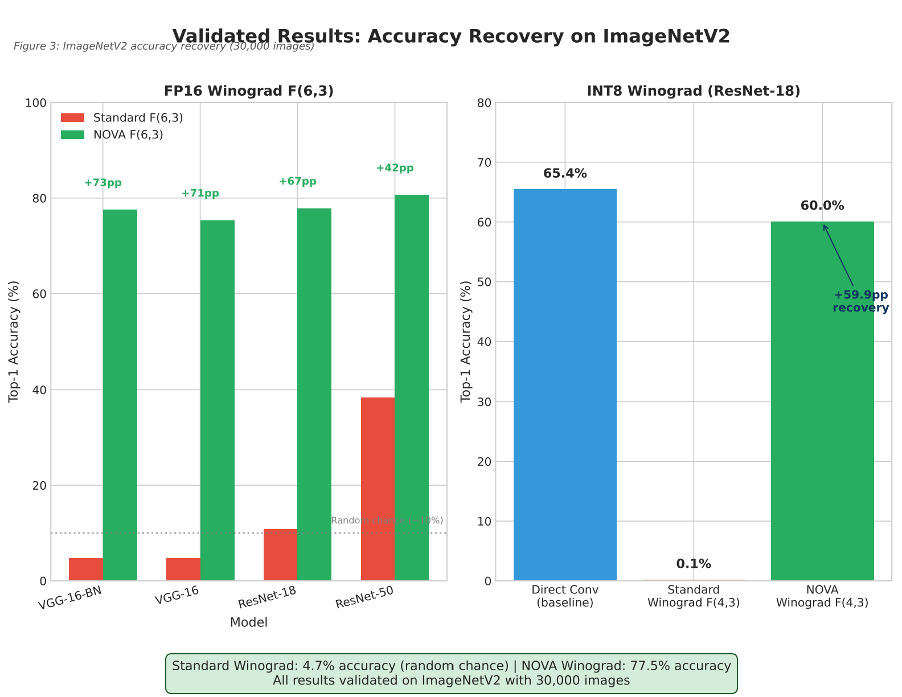
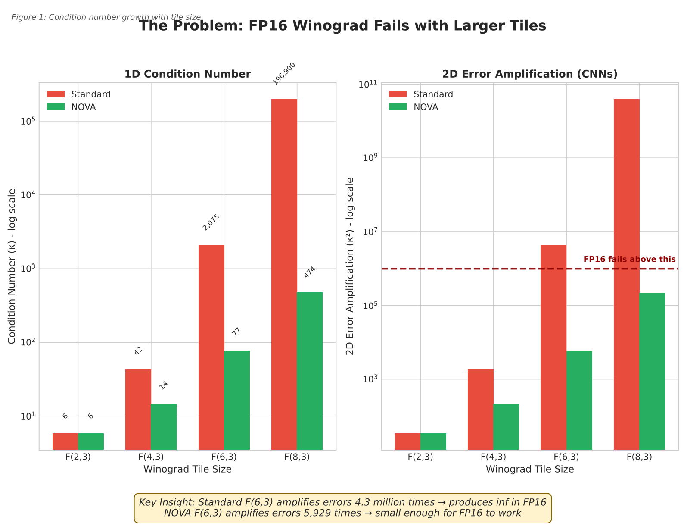

# NOVA: Rational Winograd Transforms for FP16/INT8 Stability

**Authors:** Jayant Lohia  
**Status:** Submitted to ICML 2026 (Under Review)  
[cite_start]**Paper:** [arXiv:2512.18453](https://arxiv.org/abs/2512.18453) [cite: 6]

---

## Abstract
Standard Winograd convolutions (e.g., `F(6,3)`, `F(4,3)`) provide significant speedups but suffer from **numerical instability** in low-precision arithmetic (FP16/INT8). [cite_start]This instability is caused by the high condition number of the Cook-Toom transformation matrix, which amplifies quantization errors by up to **4.3 million times**[cite: 42, 57].

[cite_start]**NOVA (Numerical Optimization of Vandermonde Arithmetic)** stabilizes these transforms by replacing standard floating-point coefficients with optimized **rational coefficients** (e.g., `±5/6`, `±7/6`) discovered via Evolution Strategies [cite: 154-159].

This repository demonstrates the numerical analysis and accuracy recovery achieved by NOVA on standard benchmarks (VGG-16, ResNet-18) using AMD/NVIDIA hardware.

---

## Key Result: Accuracy Recovery

Standard Winograd implementations in cuDNN/MIOpen often collapse to random chance when running deeper networks in FP16. NOVA restores full accuracy **without retraining**.


> **Figure 1:** VGG-16 Top-1 Accuracy on ImageNetV2. Standard FP16 Winograd fails (4.7% accuracy). [cite_start]NOVA restores baseline accuracy (77.5%) purely by swapping transform constants. [cite: 105]

---

## The Problem: The "Hardware Lottery"

The core issue is the **Condition Number** ($\kappa$) of the transform matrix $G$. As the tile size increases, the condition number grows exponentially, leading to catastrophic cancellation in FP16.

* **Standard $F(6,3)$:** $\kappa \approx 2,075$. Error amplification $\approx 4.3 \times 10^6$. [cite_start]**Result: `inf` / `NaN`**. [cite: 21, 57]
* **NOVA $F(6,3)$:** $\kappa \approx 77$. Error amplification $\approx 5,929$. [cite_start]**Result: Stable Finite Values**. [cite: 23, 61]


> [cite_start]**Figure 2:** NOVA reduces the condition number of the $F(8,3)$ transform by **415x** compared to the standard Cook-Toom implementation used in production libraries. [cite: 164, 176]

---

## The Solution: Rational Coefficients

Instead of complex "quantization-aware training" or "mixed-precision guards," NOVA solves the problem mathematically at the kernel level.

We define a search space of hardware-friendly **rational numbers** (avoiding complex floats) and use Evolution Strategies to find matrices with minimal condition numbers.

| Transform | Standard Points | NOVA Rational Points | Stability Gain |
| :--- | :--- | :--- | :--- |
| **F(4,3)** | `{0, ±1, ±2, ∞}` | `{0, ±5/6, ±7/6, ∞}` | [cite_start]**9x** (2D) [cite: 154, 176] |
| **F(6,3)** | `{0, ±1, ±2, ±0.5, ∞}` | `{0, ±3/5, ±1, ±7/6, ∞}` | [cite_start]**729x** (2D) [cite: 159, 176] |
| **F(8,3)** | *Complex Floats* | `{0, ±2/5, ±5/6, ±1, ±7/6, ∞}` | [cite_start]**172,000x** (2D) [cite: 163, 176] |

---

## Integration (Drop-in Replacement)

NOVA requires **zero code changes** to the convolution logic. It is a constant-swap patch for existing libraries like MIOpen or cuDNN.

1.  **Locate** the transform constant arrays (`G`, `B`, `A`) in the kernel assembly.
2.  **Replace** with NOVA's rational matrices.
3.  **Run** in pure FP16/INT8.

> [cite_start]**Note:** This method preserves the exact same FLOP count and memory footprint as standard Winograd. [cite: 118]

---

## Citation

If you use these stable coefficients in your research or production kernels, please cite:

```bibtex
@article{lohia2025nova,
  title={NOVA: Enabling Reliable FP16/INT8 Winograd for MIOpen},
  author={Lohia, Jayant},
  journal={arXiv preprint arXiv:2512.18453},
  year={2025}
}
